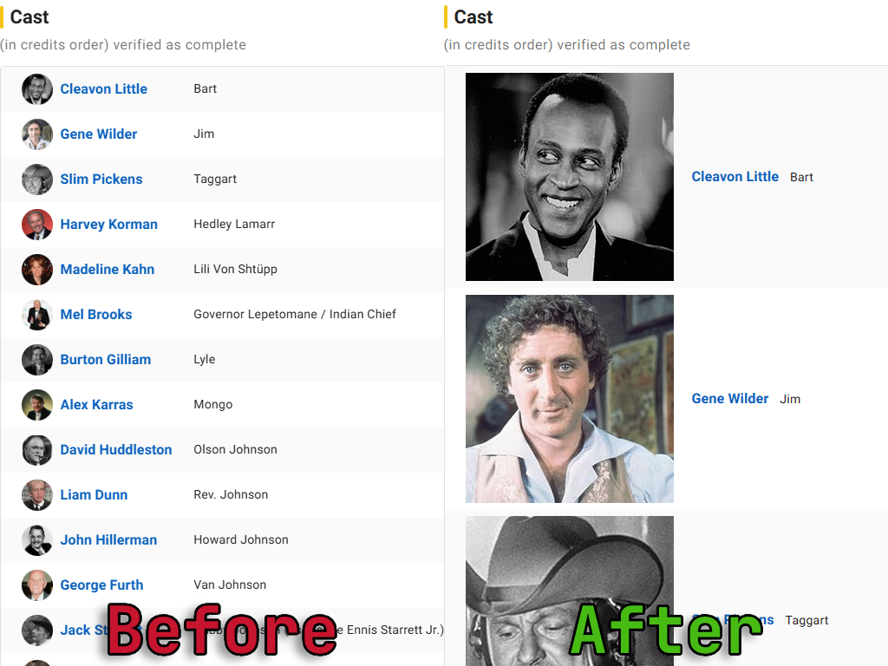
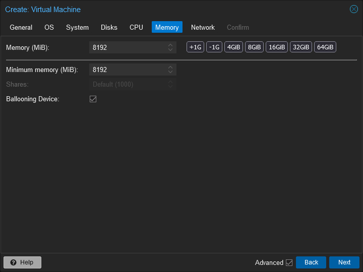

# Userscripts

A small collection of personal userscripts, organized by site and kept installable from GitHub.

## Repository Layout

- `scripts/chatgpt/` contains ChatGPT-specific userscripts.
- `scripts/imdb/` contains IMDb-specific userscripts.
- `scripts/proxmox/` contains Proxmox-specific userscripts and configuration notes.
- `scripts/reddit/` contains Reddit-specific userscripts.
- `scripts/youtube/` contains YouTube-specific userscripts.
- `docs/INSTALL.md` covers installation and update workflow.

## Script Index

| Site | Script | What it does | Install |
| --- | --- | --- | --- |
| ChatGPT | [ChatGPT Dark Grey Theme](scripts/chatgpt/chatgpt-dark-grey-theme.js) | Restores ChatGPT's charcoal dark theme instead of the OLED black theme. | [Install](https://raw.githubusercontent.com/Landmine-1252/userscripts/main/scripts/chatgpt/chatgpt-dark-grey-theme.js) |
| IMDb | [IMDB Larger Photos](scripts/imdb/imdb-larger-photos.user.js) | Enlarges cast photos on IMDb full credits pages. | [Install](https://raw.githubusercontent.com/Landmine-1252/userscripts/main/scripts/imdb/imdb-larger-photos.user.js) |
| Proxmox | [Proxmox VM Memory Buttons](scripts/proxmox/proxmox-vm-memory-buttons.user.js) | Adds quick memory preset buttons and +/- 1 GiB controls to the Create VM wizard. | [Install](https://raw.githubusercontent.com/Landmine-1252/userscripts/main/scripts/proxmox/proxmox-vm-memory-buttons.user.js) |
| Reddit | [Load Reddit Images Directly](scripts/reddit/reddit-load-images-directly.user.js) | Rewrites Reddit image post links so thumbnails open the hosted image instead of the post page when a direct image is available. | [Install](https://raw.githubusercontent.com/Landmine-1252/userscripts/main/scripts/reddit/reddit-load-images-directly.user.js) |
| YouTube | [YouTube Shorts Redirect](scripts/youtube/youtube-shorts-redirect.user.js) | Redirects `/shorts/...` URLs to standard `/watch?v=...` URLs and rewrites Shorts links in-page before navigation. | [Install](https://raw.githubusercontent.com/Landmine-1252/userscripts/main/scripts/youtube/youtube-shorts-redirect.user.js) |

Proxmox setup note: update the `@match` line before installing. See [scripts/proxmox/README.md](scripts/proxmox/README.md).

## Notes

- Proxmox scripts are intentionally scoped to specific hosts. Keep their `@match` rules narrow.
- The old empty `proxmox-vm-memory-slider.js` placeholder was removed. The idea is documented in the Proxmox folder until there is working code.
- These scripts target current site layouts and may need maintenance when upstream UI changes.
